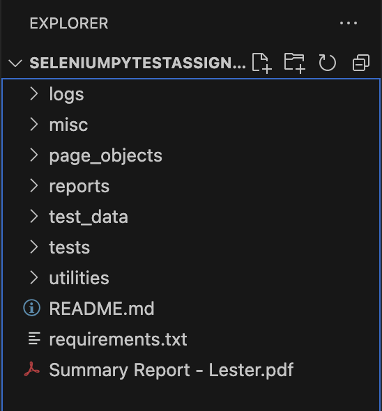
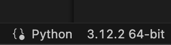
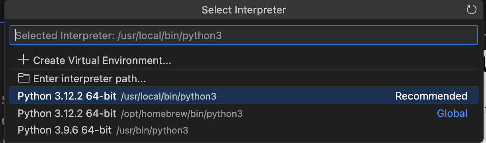
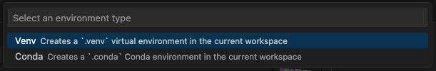
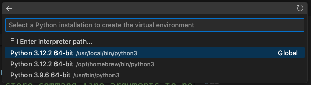
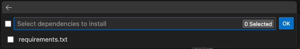
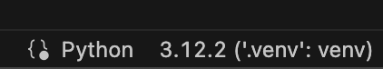
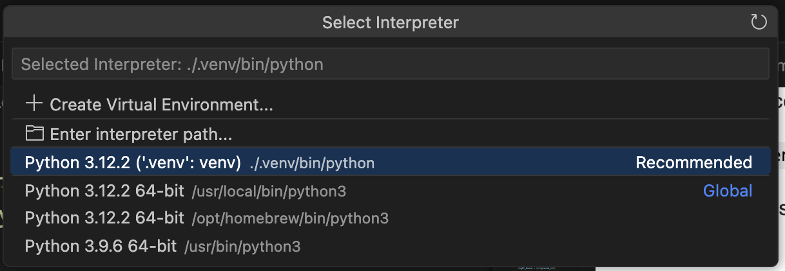
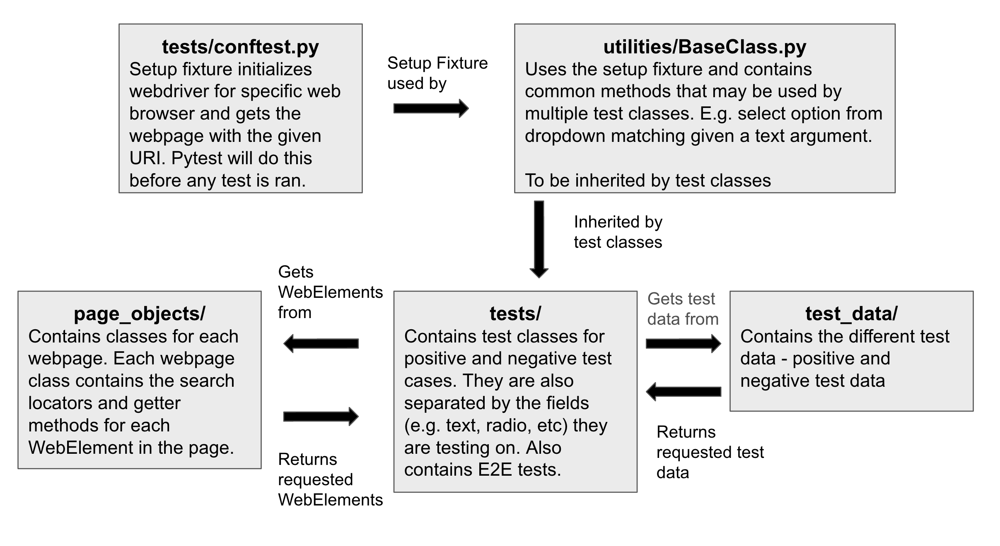

# Selenium Pytest Assignment - Lester
Project files for the assignment.

### Objectives
Visit the website: https://formy-project.herokuapp.com/form

Write test cases for all available features in the website using Selenium with Pytest.

### To run the code
Be sure you have installed Python and have your favourite code editor installed. I'll be using VS code.

With a fresh instance of VS code or other editors supporting Python, open / drag the folder `PythonSeleniumAssignment - Lester` into the workspace. You might want to ensure you have no other workspace / folders opened before opening it.

Your workspace may look similar to this:

Create a local Python version environment in the workspace (If you already know how then skip this after doing it):

* Open any `.py` file in the project
* On your bottom right corner (VScode)

* Click on the version number / "select an interpreter" if yours reflects that and you should see

* Click on "Create Virtual Environment"
* Select `Venv`

* Choose an installation, you can choose the one marked Global

* You can choose to select the `requirements.txt` to install the dependencies used in this project. If you chose this you can skip the installing dependencies step below. Otherwise click OK.

If you are interested, you may check this [link](https://realpython.com/python-virtual-environments-a-primer/) on why we should use Python virtual environments for every project.

Be sure that the Python interpreter for the environment is selected for the project (check bottom right of VScode):

if it doesn't reflect `".venv": venv` click on it and select:

Also make sure `(.venv)` appears in your terminal. You may have to kill your existing terminal by clicking on the bin and open a new one. If it doesn't appear give it awhile to reflect before killing it again and opening a new terminal.

#### Installing dependencies

If you didn't select the `requirements.txt` file during the setup of the virtual environment, install the dependencies listed in `requirements.txt` by running:

`pip3 install -r requirements.txt` or `pip install -r requirements.txt`

#### Running the tests
To run the entire test framework (defaults to Chrome browser):

`pytest tests/ --html=reports/report.html --self-contained-html`

To choose among the different web broswers:
* **Google Chrome**
`pytest tests/ --html=reports/report.html --self-contained-html --browser_name chrome`

* **Mozilla Firefox**
`pytest tests/ --html=reports/report.html --self-contained-html --browser_name firefox`

* **Edge**
`pytest tests/ --html=reports/report.html --self-contained-html --browser_name edge`

* **Safari**
`pytest tests/ --html=reports/report.html --self-contained-html --browser_name safari`

Feel free to chain more arguments in the test command:
`-s -v --cov`

You may view the detailed test report and logs in  `/reports/report.html` and `/logs/logfile.log` respectively.

You may also view the summary report I prepared in `Summary Report - Lester.pdf`

### Project Structure
**Local Packages**:
* `page_objects` - class file containing locators and getters for each locator in the form page.
* `test_data` - sets of test data 
* `utilities` - common class and methods used by one or more test classes
* `tests` - test classes and contains configuration file `conftest.py`

**Logs**:
* `logs/logfile.log`

**Reports**:
* `reports/report.html`

The following image illustrates how the packages interact during the test process:

I've structured in this manner so that this project can be used as a framework scaling into larger test cases involving multiple pages (e.g. company website). New pages can be added as a new page object in `page_objects`. Likewise, new test cases on the new pages can be named and grouped accordingly in the `tests` folder. Abstracting away the getting of WebElements allows better focus on test cases in `test/`.

### Test cases
Understandably being a dummy test website, I've made various assumptions on the fields.
* The form is used to collect personal particulars of the user.
* The date field is assumed to be the user's date of birth.
* All fields should be marked as required.
* The radio buttons and checkbox fields for highest education level and sex should only allow one item to be selected.
* Radio button for highest education level should automatically deselect if the user selects on any of the other choices.
* The checkbox for sex should allow users to uncheck a selected box if they click on it.
* No restriction on the characters for all text input fields.

Based on these assumptions, I've grouped the test cases into **positive** and **negative** test cases.

#### Positive test case
This assumes the user fills the fields in the form correctly in one go without violating the above assumptions. Test data will reflect accordingly. 

Individual tests on respective WebElements will check that the value captured by the fields reflects what is specified in the test data.

The end to end testing will check that the keyword `"success"` appears in the alert message.

#### Negative test case
This assumes the user fills the fields in the form with either erroneous data or leaves the field empty. The test data will reflect accordingly.

Individual tests on respective WebElements will check for:
* Only one Radio and checkbox element remained selected after multiple selections. 
* User is able to uncheck previously selected checkbox option by click it again.
* Form submission with any empty field should not be a success. Other fields except for field in testing will be populated with proper data. The field in testing will be left blank and form will be submitted.

End to end testing will check that `"success"` should not appear in the alert after submission with errorneous or missing field data.

#### Use of pytest-check
Ideally, we wouldn't be using `pytest-check` to couple with our assertion statements as part of our checks. Reason being negative test cases are just different permutations of each other, so if one fails, there is no need to run other permutations.

However, for the purposes of this assignment, I've coupled some assertion statements with `check` so that the entire set of negative test data can be ran.

### Future Work
Ideally, test cases derived from various techinques (black-box, white-box, etc) could be included for wider and practical coverage but this will entail further clarification on the intention and assumptions made on the web page. Nonetheless, the following suggested test cases could be included for comprehensiveness:
* User may repeatedly populates and clears the input field. We can check that the latest field value is indeed the most recent input.
* Date field values can be tested for equality if the user decides to input the field by clicking the calendar.

